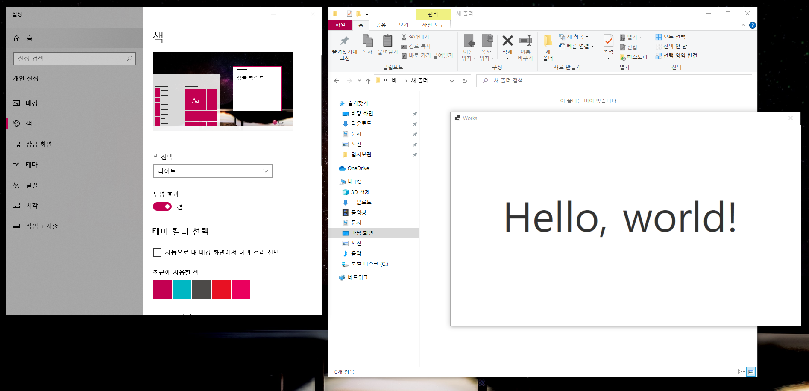

## 📕 프로젝트 개요(Introduce Project)

### Sycn Windows Theme

* 윈도우 테마 모드(Windows Theme Mode)에 따라 윈도우 폼(Window Form) 테마를 변경합니다.  

## 🏷️ 기능(Function)

1. [윈도우(Windows) 테마 동기화](#윈도우(Windows)-테마-동기화)

### 세부 기능(Function Detail)

#### 윈도우(Windows) 테마 동기화

   1. 레지스트리를 확인하여 윈도우 테마 변경사항을 확인하고 적용합니다.

## 💻 개발 환경(Develop Environment)

### 세부 환경(Environment Detail)

* ✔ OS : 
  * 🕒 Version : `11 Pro`
* ✔ Language : 
* ✔ Dependency : 
  * 🕒 Version : `6.0`

## 📖 비고(Remark)

* 레지스트리 경로(Windows Registry Path)
* `컴퓨터\HKEY_CURRENT_USER\SOFTWARE\Microsoft\Windows\CurrentVersion\Themes\Personalize`
* AppsUseLightTheme
   |Value|AppsUseLightTheme (기본 앱 테마 선택)|
   |:-:|:-:|
   |0|다크(`Dark`)|
   |1|라이트(`Light`)|
* EnableTransparency
   |Value|EnableTransparency (기본 앱, 작업 표시줄 투명효과)|
   |:-:|:-:|
   |0|사용 안함|
   |1|사용|
* ColorPrevalence
   |Value|ColorPrevalence (기본 앱, 작업 표시줄 색상 적용)|
   |:-:|:-:|
   |0|사용 안함|
   |1|사용|
* SystemUsesLightTheme
   |Value|SystemUsesLightTheme (기본 Windows 테마 모드)|
   |:-:|:-:|
   |0|다크(`Dark`)|
   |1|라이트(`Light`)|

* 윈도우(Windows) 다크 모드

* 윈도우(Windows) 라이트 모드

